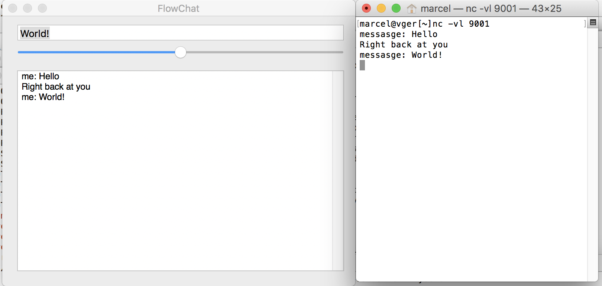
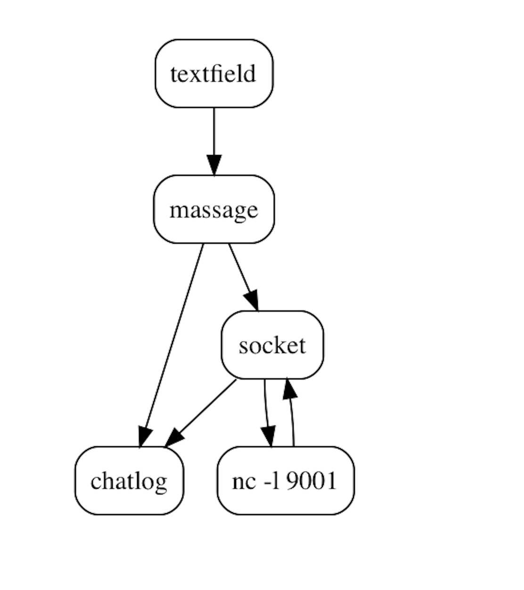

# FlowChat
Super simplistic network chat application demonstrating the use of ObjectFlow in GUI/networking application.

It is a simple chat client that talks to a local server on port 9001.  (You need to start this manually via `nc -l 9001` in  Terminal window).




Anything typed into the input textfield gets echoed to the chat log and sent to the socket, and any input received from the socket is also echoed to the chat log.



The code of the application is a pipe defined in the AppDelegate's `applicationDidFinishLaunching:` method, and reflects the diagram fairly directly:


```
- (void)applicationDidFinishLaunching:(NSNotification *)aNotification
{
    MPWByteStream *console=[MPWByteStream stream];
    NSURL *chatserver=[NSURL URLWithString:@"socket://localhost:9001"];
    MPWSocketStream *socket=[[MPWSocketStream alloc] initWithURL:chatserver];
    
    self.pipe=[MPWPipe filters:
                 @[ self.messageBox,
                    @"%%@\n",
                    @[
                       @[ @"%me: %@", console] ,
                       @[[MPWByteStream stream], socket,  console ] ],
                  ]
               ];
    
    [self.pipe setTarget:self.messages.textStorage.mutableString];
    [socket open];
}


```

The pipe specification is an array of filters, with various kinds of objects interpreted specially.  An `NSControl` such as the messageBox is adapted to a stream source that sends its contents via target/action to the stream.  The string prefixed with "%" is interpreted as a format string.

An array in a filter array means that the stream is split at this point and the result of the previous filter piped into both substreams.  In this case, the message that was typed into the messageBox is sent to both the chatlog (console) and the socket).

The socket output is also sent to the chatlog.

#### Building

Use `carthage update` in the project's root directory to fetch and build the `MPWFoundation` framework.  Then build/run via Xcode.


